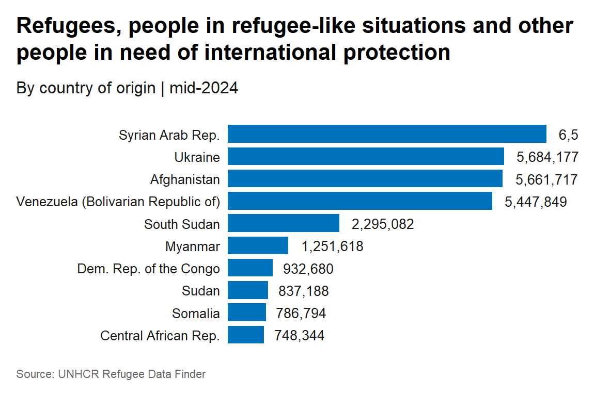

# refugees

[](https://cran.r-project.org/package=refugees)

`refugees` is an R package designed to facilitate access to the United
Nations High Commissioner for Refugees (UNHCR) Refugee Data Finder. It
provides an easy-to-use interface to the database, which covers forcibly
displaced populations, including refugees, asylum-seekers, internally
displaced people, stateless people, and others over a span of more than
70 years.

This package provides data from three major sources:

1.  Data from UNHCR’s annual statistical activities dating back to 1951.

2.  Data from the United Nations Relief and Works Agency for Palestine
    Refugees in the Near East (UNRWA), specifically for registered
    Palestine refugees under UNRWA’s mandate.

3.  Data from the Internal Displacement Monitoring Centre (IDMC) on
    people displaced within their country due to conflict or violence.

## Datasets

The `refugees` package includes eight datasets:

1.  `population`: Data on forcibly displaced and stateless persons by
    year, including refugees, asylum-seekers, returned refugees,
    internally displaced persons (IDPs), and stateless persons.

2.  `idmc`: Data from the Internal Displacement Monitoring Centre on the
    total number of IDPs due to conflict and violence.

3.  `asylum_applications`: Data on asylum applications including
    procedure type and application type.

4.  `asylum_decisions`: Data on asylum decisions, including recognised,
    rejected, and otherwise closed claims.

5.  `demographics`: Demographic and sub-national data, where available,
    including age and sex disaggregation.

6.  `solutions`: Data on durable solutions for refugees and IDPs.

7.  `unrwa`: Data on registered Palestine refugees under UNRWA’s
    mandate.

8.  `flows`: Numbers of the people forced to flee during each of the
    years since 1962.

Please check the individual dataset description for more details on the
content of each dataset.

## Installation

Install either from CRAN with:

``` r
install.packages("refugees")
```

Or retrieve the development version from Github using the
[`pak`](https://pak.r-lib.org/) package:

``` r
pak::pkg_install("PopulationStatistics/refugees")
```

## Usage

Here are some examples of how you can use the
``` refugees`` package. The ```population\` dataset can be used to
easily get data on forced displacement or statelessness.

``` r
library(refugees)
library(dplyr)
glimpse(refugees::population)
#> Rows: 132,602
#> Columns: 16
#> $ year              <dbl> 1951, 1951, 1951, 1951, 1951, 1951, 1951, 1951, 1951…
#> $ coo_name          <chr> "Unknown", "Unknown", "Unknown", "Unknown", "Unknown…
#> $ coo               <chr> "UKN", "UKN", "UKN", "UKN", "UKN", "UKN", "UKN", "UK…
#> $ coo_iso           <chr> "UNK", "UNK", "UNK", "UNK", "UNK", "UNK", "UNK", "UN…
#> $ coa_name          <chr> "Australia", "Austria", "Belgium", "Canada", "Denmar…
#> $ coa               <chr> "AUL", "AUS", "BEL", "CAN", "DEN", "FRA", "GBR", "GF…
#> $ coa_iso           <chr> "AUS", "AUT", "BEL", "CAN", "DNK", "FRA", "GBR", "DE…
#> $ refugees          <dbl> 180000, 282000, 55000, 168511, 2000, 290000, 208000,…
#> $ asylum_seekers    <dbl> 0, 0, 0, 0, 0, 0, 0, 0, 0, 0, 0, 0, 0, 0, 0, 0, 0, 0…
#> $ returned_refugees <dbl> 0, 0, 0, 0, 0, 0, 0, 0, 0, 0, 0, 0, 0, 0, 0, 0, 0, 0…
#> $ idps              <dbl> 0, 0, 0, 0, 0, 0, 0, 0, 0, 0, 0, 0, 0, 0, 0, 0, 0, 0…
#> $ returned_idps     <dbl> 0, 0, 0, 0, 0, 0, 0, 0, 0, 0, 0, 0, 0, 0, 0, 0, 0, 0…
#> $ stateless         <dbl> 0, 0, 0, 0, 0, 0, 0, 0, 0, 0, 0, 0, 0, 0, 0, 0, 0, 0…
#> $ ooc               <dbl> 0, 0, 0, 0, 0, 0, 0, 0, 0, 0, 0, 0, 0, 0, 0, 0, 0, 0…
#> $ oip               <dbl> NA, NA, NA, NA, NA, NA, NA, NA, NA, NA, NA, NA, NA, …
#> $ hst               <dbl> 0, 0, 0, 0, 0, 0, 0, 0, 0, 0, 0, 0, 0, 0, 0, 0, 0, 0…
```

The `population` dataset can be used to get the 10 countries of origin
with highest number of refugees, people in refugee-like situations
including people in need of international protection in 2022.

``` r
ref_coo_10 <- refugees::population |>
  filter(year == 2022) |>
  summarise(refugees = sum(refugees, na.rm = TRUE) + sum(oip, na.rm = TRUE),
            .by = coo_name) |>
  slice_max(order_by = refugees, n = 10)
ref_coo_10
#> # A tibble: 10 × 2
#>    coo_name                           refugees
#>    <chr>                                 <dbl>
#>  1 Syrian Arab Rep.                    6559736
#>  2 Ukraine                             5684177
#>  3 Afghanistan                         5661717
#>  4 Venezuela (Bolivarian Republic of)  5447849
#>  5 South Sudan                         2295082
#>  6 Myanmar                             1251618
#>  7 Dem. Rep. of the Congo               932680
#>  8 Sudan                                837188
#>  9 Somalia                              786794
#> 10 Central African Rep.                 748344
```

We can use `ggplot2` and the
[`unhcrthemes`](https://github.com/unhcr-dataviz/unhcrthemes) to
visualize our data following the [UNHCR data visualization
guidelines](https://dataviz.unhcr.org/).

``` r
library(ggplot2)
library(unhcrthemes)

ref_coo_10 |>
  ggplot(aes(refugees, reorder(coo_name, refugees))) +
  geom_col(fill = unhcr_pal(n = 1, "pal_blue"),
           width = 0.8) +
  geom_text(aes(label = scales::label_comma()(refugees)),
            hjust = -0.2) +
  scale_x_continuous(expand = expansion(mult = c(0, 0.1))) +
  labs(title = "Refugees, people in refugee-like situations and other people in need of international protection",
       subtitle = "By country of origin | mid-2024",
       caption = "Source: UNHCR Refugee Data Finder") +
  theme_unhcr(font_size = 12,
              grid = FALSE,
              axis = FALSE,
              axis_title = FALSE,
              axis_text = "y")
```



For more examples, see [How to use UNHCR’s refugees R
package](https://www.unhcr.org/refugee-statistics/insights/explainers/refugees-r-package.html).

## License

This package is released under the [Creative Commons Attribution 4.0
International Public
License](https://creativecommons.org/licenses/by/4.0/).
